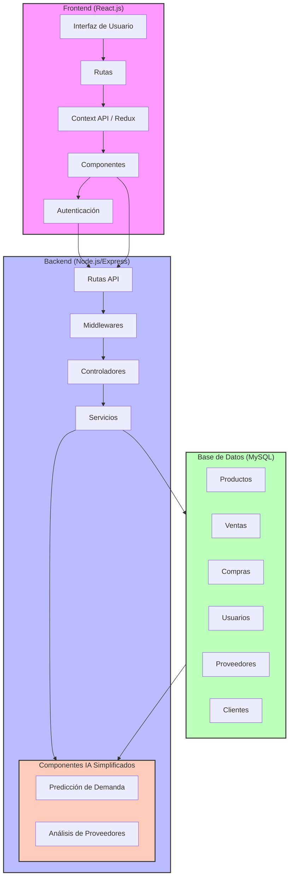

```mermaid
flowchart TB
    %% CAPA DE PRESENTACIÓN
    subgraph Frontend["Frontend (React.js)"]
        UI["Interfaz de Usuario"]
        Routes["Rutas"]
        Context["Context API / Redux"]
        Auth["Autenticación"]
        Components["Componentes"]
    end

    %% CAPA DE API
    subgraph Backend["Backend (Node.js/Express)"]
        Routes_BE["Rutas API"]
        Middlewares["Middlewares"]
        Controllers["Controladores"]
        Services["Servicios"]
        subgraph IASimple["Componentes IA Simplificados"]
            Prediccion["Predicción de Demanda"]
            Analisis["Análisis de Proveedores"]
        end
    end

    %% BASE DE DATOS
    subgraph DB["Base de Datos (MySQL)"]
        Productos["Productos"]
        Ventas["Ventas"]
        Compras["Compras"]
        Usuarios["Usuarios"]
        Proveedores["Proveedores"]
        Clientes["Clientes"]
    end

    %% CONEXIÓN FRONT-END - BACK-END
    UI --> Routes
    Routes --> Context
    Context --> Components
    Components --> Auth

    %% CONEXIÓN BACK-END - FRONT-END
    Auth --> Routes_BE
    Components --> Routes_BE

    %% CONEXIÓN BACK-END - BD
    Routes_BE --> Middlewares
    Middlewares --> Controllers
    Controllers --> Services
    Services --> IASimple
    Services --> DB

    %% CONEXIÓN BD - IA
    DB --> IASimple

    %% ESTILOS
    classDef frontend fill:#f9f,stroke:#333,stroke-width:2px;
    classDef backend fill:#bbf,stroke:#333,stroke-width:2px;
    classDef database fill:#bfb,stroke:#333,stroke-width:2px;
    classDef ai fill:#fcb,stroke:#333,stroke-width:2px;
    
    class Frontend frontend;
    class Backend backend;
    class DB database;
    class IASimple ai;
```
