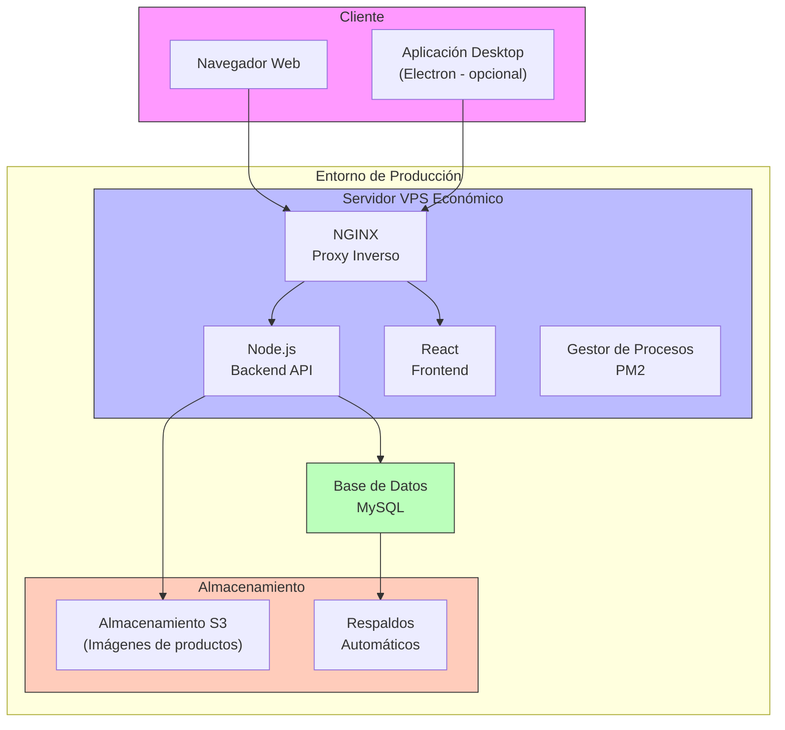

# Infraestructura y Despliegue del Sistema de Gestión para Refaccionaria

## Diagrama de Infraestructura



## Entornos de Despliegue

### Desarrollo
- **Entorno Local**: Máquinas de desarrolladores
- **Herramientas**: Docker para servicios, nodemon para hot-reload
- **Base de datos**: MySQL local o contenedor Docker
- **Configuración**: Variables de entorno para desarrollo en `.env.development`

### Pruebas/QA
- **Entorno**: Servidor compartido de bajo costo
- **Despliegue**: Manual o script automatizado simple
- **Base de datos**: Instancia MySQL separada para pruebas
- **Configuración**: Variables de entorno para testing en `.env.test`

### Producción
- **Entorno**: Servidor VPS económico (ej. DigitalOcean Droplet)
- **Especificaciones mínimas**:
  - 2GB RAM
  - 2 vCPUs
  - 50GB SSD
  - Linux Ubuntu 20.04+
- **Configuración**: Variables de entorno para producción en `.env.production`

## Proceso de Despliegue

### Preparación Inicial del Servidor
1. Instalar dependencias del sistema:
   ```bash
   apt-get update
   apt-get install -y nginx nodejs npm mysql-client
   ```
2. Configurar NGINX como proxy inverso
3. Instalar PM2 para gestionar procesos de Node:
   ```bash
   npm install -g pm2
   ```
4. Configurar el firewall (UFW):
   ```bash
   ufw allow ssh
   ufw allow http
   ufw allow https
   ufw enable
   ```

### Despliegue Manual
1. Clonar el repositorio:
   ```bash
   git clone https://github.com/usuario/refaccionaria-sistema.git
   cd refaccionaria-sistema
   ```
2. Instalar dependencias:
   ```bash
   npm install
   cd src/frontend
   npm install
   cd ../..
   ```
3. Construir frontend:
   ```bash
   cd src/frontend
   npm run build
   cd ../..
   ```
4. Configurar variables de entorno:
   ```bash
   cp .env.example .env.production
   # Editar .env.production con los valores adecuados
   ```
5. Iniciar servicios con PM2:
   ```bash
   pm2 start ecosystem.config.js --env production
   ```

### Script de Despliegue Automatizado
Se incluye un script básico de despliegue (`scripts/deploy.sh`):
```bash
#!/bin/bash
# Despliegue automático del sistema de refaccionaria

# Actualizar código
git pull

# Instalar dependencias backend
npm install

# Construir frontend
cd src/frontend
npm install
npm run build
cd ../..

# Reiniciar servicios
pm2 reload ecosystem.config.js --env production

# Verificar estado
pm2 list
```

### Respaldos de Base de Datos
El sistema incluye un script automático de respaldo (`scripts/backup.js`) que:
1. Realiza un dump de la base de datos cada día
2. Comprime el dump con fecha y hora
3. Puede subir el respaldo a S3 o almacenamiento similar
4. Mantiene un historial de 30 días y purga respaldos antiguos

## Monitorización
- **PM2**: Para monitorización básica del proceso Node.js
- **Healthcheck**: Endpoint `/api/health` para verificar estado
- **Logs**:
  - Log de aplicación: `/var/log/refaccionaria-app.log`
  - Log de NGINX: `/var/log/nginx/`
  - Log de PM2: `~/.pm2/logs/`

## Seguridad de la Infraestructura
- **HTTPS**: Certificado SSL gratuito con Let's Encrypt
- **Headers de Seguridad**: Configurados en NGINX
- **Acceso a Base de Datos**: Restringido solo al servidor de aplicación
- **Firewall**: UFW configurado para exponer solo los puertos necesarios

## Escalabilidad
Para una refaccionaria pequeña, esta infraestructura simple es suficiente para soportar:
- Hasta 50 usuarios concurrentes
- Catálogo de hasta 100,000 productos
- 500+ transacciones diarias

Si el negocio crece significativamente, se podría:
1. Migrar a un servidor más potente
2. Separar base de datos a un servidor dedicado
3. Implementar un balanceador de carga básico

## Requerimientos de Hardware para Clientes
Requisitos mínimos para terminales cliente:
- Procesador: Dual Core 2GHz+
- RAM: 4GB+
- Navegador: Chrome, Firefox, Edge actualizados
- Conectividad: 5 Mbps+
